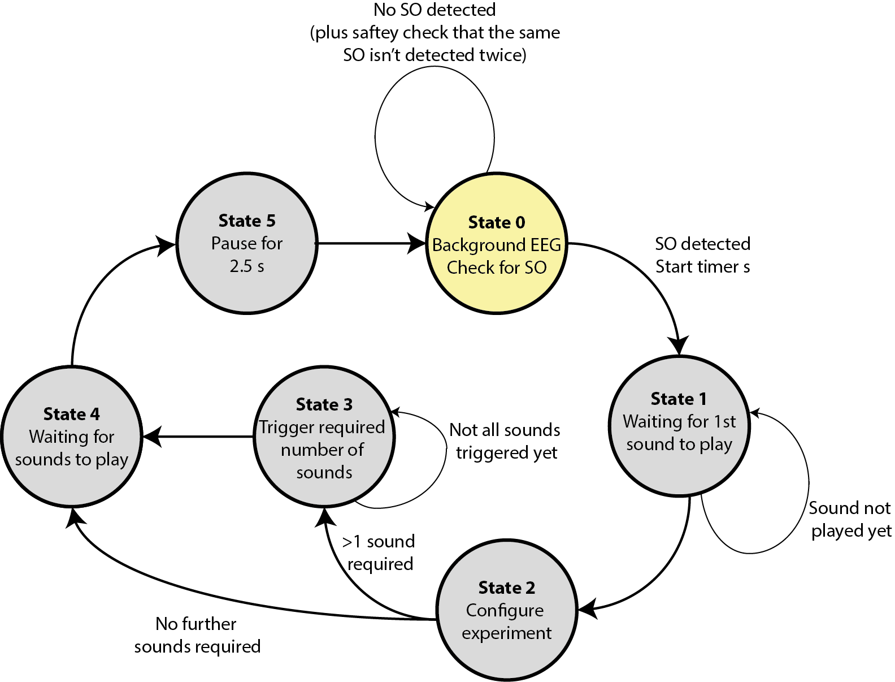

# Closed Loop Sound Stimulation During Sleep In Matlab

## About
This is a Matlab App which streams EEG data in real-time, detects the presence of a slow oscillation, and plays audio-tones after a delay. It is our implementation of an auditory closed loop stimulation platform as first described in https://doi.org/10.1016/j.neuron.2013.03.006. Our implementation is in Matlab to allow easy exploration of different settings, stimulation protocols, delays, sounds and similar compared to using a lower level language (if using a higher level language introduces its own challenges).

The App interfaces with a Natus Embla EEG amplifier and RemLogic PSG software, and out of the box will only operate with these. It was designed to run on a background service optimized, non-networked, lab PC running Windows 7. Service optimization included turning off all non-essential background tasks, and running Matlab at a higher priority level. The computer has Matlab 2007b, with a limited set of toolboxes. Thus, some functions which would be 'easy' with newer versions of Matlab or with particular toolboxes are hard coded.

The code has been used in our publication DOI: XXX - TBC at time of publication. 

## Operation
We have a large number of different configurations of the system. These will present different sounds to the participant, e.g. pink noise or recognisable sounds, different lengths of trains, and similar. Thus large parts of the code made be commented out depending on which mode is being used. The text below overviews the general mode operation.

stim_gui.m is the main launch script and is run from the Matlab command prompt to start the processing. This calls stim_gui_functions.m which generates the GUI. It calls stim_main.m which returns a timer object t. This timer is started when people press the start button and the actions are then performed by this timer. The set up of the timer includes calling generate_sounds.m which makes the different sounds to be played to the participant.  It is assumed that an experimenter is present monitoring the incoming EEG and who turns the sound stimulation on and off depending on whether the participant is in deep sleep. We have two sleep rooms, and calibrated the volume for the headphones used in each room to give the same measured volume. 

The timer t is set to run every 100 ms by default. When it runs it calls get_and_process_data.m. This loads the last 30 s of data and filters it into the SO band. (Filter coefficients were generated offline using the Matlab butter command and saved in butterworth_coefficients.m). Before filtering the data is mirrored to avoid edge effects, but there is no correction of the group delay introduced by the filtering. Filtered data is then passed to state_machine.m which makes the decision of whether to stimulate or not.

state_machine.m operates as a Finite State Machine (https://en.wikipedia.org/wiki/Finite-state_machine) to move between the different point stimulation stages. The state variable is stored in param.state. At all times the delay between when the timer t was triggered and the time of the current operation is recorded, and subtracted off from the timing of future operations in order to keep events happening at the correct time. In addition a manual delay correction can be added based upon calibration of the system and measuring the actual delays present. A second timer called s is present and is responsible for playing a sound after the delay which has been selected. Stim and sham and adaptation modes are present. In the sham mode the process is exactly the same, so that all of the processes are identical, but the sound played is zeros and so makes no actual noise.

The operation is shown in the diagram below where SO stands for Slow Oscillation. 

The SO detection algorithm is in so_detection_algorithm.m and is a simple re-implementation of the threshold based algorithm used in https://doi.org/10.1016/j.neuron.2013.03.006. The threshold used can be set in the Matlab GUI and an adaptation night used to select the appropriate value for each person. When an SO is detected timer s is started, with the sound to played param.fd after the SO trough where param.fd is set in the Matlab GUI. The system then waits in state 1 until the sound is played. State 2 configures the experiment to be performed, and we have quite a few different versions (only one of which will be un-commented in the code). If on an adaptation night usually there is only one sound played at the peak of the SO in which case the system moves straight to state 4. Otherwise it moves to state 3. State 3 triggers the required sounds and moves to state 4 once all of them have been triggered. On experimental nights there may be 1 further click, or 4 further clicks, or longer trains, with these in a fixed order, random order, counter-balanced, and so on. Once all of the sounds have been played the system moves to state 5. This plots the SO epoch in the GUI and triggers a pause of (usually) 2.5 seconds before the system starts checking for SOs again.

## Dependencies

## License information
This code uses the following third party tools:
 - extrema.m: Carlos Adrian Vargas Aguilera (2022). extrema.m, extrema2.m (https://www.mathworks.com/matlabcentral/fileexchange/12275-extrema-m-extrema2-m), MATLAB Central File Exchange. License details are given in LICENSE_extrema.txt
 - nanmean.m: Jan Gläscher (2022). NaN Suite (https://www.mathworks.com/matlabcentral/fileexchange/6837-nan-suite), MATLAB Central File Exchange. License details are given in LICENSE_nanmean.txt
 - generate_sounds.m: The 1/f noise filter in this function uses the algorithm from Kasdin, N.J.. Discrete simulation of colored noise and stochastic processes and
1/f^{\alpha} power law noise generation. Proc IEEE 1995;83(5):802–27. The code was taken from a "Matlab answer" (https://uk.mathworks.com/matlabcentral/answers) to a 2007 post called "How to do I generate pink noise in Matlab or Simulink?". As far as we are aware this post is no longer online, but the code was freely available online for use. 
 - ebm_header.m: Uses code from the biosig project http://biosig.sourceforge.net/ and https://doi.org/10.1155%2F2011%2F935364 which is released under a GPL3 license. This project uses a GPL3 to match this. See LICENSE for details.
 -  nircmd.exe: Is shared from https://www.nirsoft.net/utils/nircmd.html. It is released as freefare with re-distribution rights as long all all of the files in the package (in nircmd.zip) are shared without modification.

## Acknowledgements
We would like to thank Jussi Virkkala, Physicist at Helsingin ja Uudenmaan sairaanhoitopiiri, Finland for his assistance in loading RemLogic EEG traces in to Matlab in real-time.
